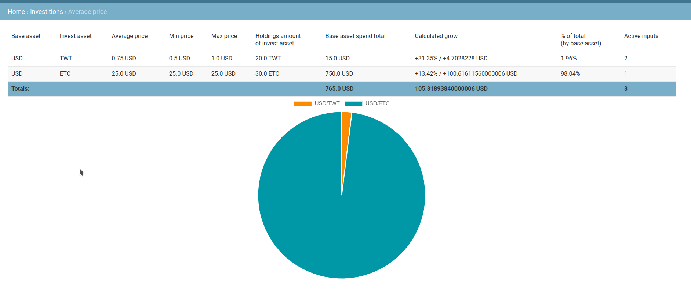

# Tradiary

An application for keeping a trading diary and analyzing transactions on the stock exchange.

### Setup

Create .env file in project root, near `.env.example` with `cp .env.example .env`. Obtain your own token from https://coinmarketcap.com/api/ and place it to `COINMARKETCAP_TOKEN` variable.

If you wanna to restore prepared pairs, run next command:

```bash
docker-compose run --rm tradiary ./manage.py loaddata fixtures/*
```

Then run application with

```bash
docker-compose up -d
```

Then next create user with command:

```bash
docker-compose run --rm tradiary ./manage.py createsuperuser
```

Then next, when you have placed token to `.env` file, you can update quotes with command

```bash
docker-compose run --rm tradiary ./managa.py update_quotes

# If all success configured. You will see next
BTC/USD fetching... pair.current_quote=2.5629348910151322e-05
USD/BNB fetching... pair.current_quote=390.4560609243073
USD/ETC fetching... pair.current_quote=28.35387052295031
USD/ETH fetching... pair.current_quote=2863.1938518639304
USD/SOL fetching... pair.current_quote=88.05044779367114
USD/TWT fetching... pair.current_quote=0.985141137230844
USD/XRP fetching... pair.current_quote=0.6198351543386401
```


In docker quotes will automacity updated every 3 hours by https://github.com/mcuadros/ofelia scheduler.


### Usage

##### Terminology

`Asset` - an base unit. Dollar or an active. BTC, SP500, etc...

`Pair` - an base asset and an second asset with quote. Quote is price of second asset in calculation by primary. For example: In case, when Ethereum costs 2900$. Base asset are USD and slave asset are ETH. Market quote: 2900. It's meaning that 1 item of slave asset equals 2900 items of primary asset.

`Trade` - Is a transaction made at a time with a certain pair, by its nature, which is either the purchase or sale of a secondary asset relative to the underlying asset, having the volume of purchased / sold assets and the base price for 1 unit of the asset.

For example. You have 100$ and bought 200 TWT for 0.50$. You should create an Trade with pair "USD/TWT". Fill "Side" fields as "Buy", fill "Price asset" field as "0.5" and "Amount of asset" as 200.

`Investition` - in the context of the application, this is a pair of transactions - buying and selling. The investment must necessarily refer to an asset purchase transaction. If an investment has only a link to a buy deal, then such an investment is considered open; if it has a link to both a buy deal and an asset sell deal, that investment is considered closed. The application will automatically calculate the state of the investment.

`Average price` - trading technique. In the application represented as report of opened (without link to closed Trade) investitions, located in "Investitions › Average price"



`Base asset` - In usage - USD, EUR, BTC, etc…

`Second asset` - An asset like TWT, Ethereum and others. You can create own in the Asset section.

`Average price` - Average price of enters. For example. You bought 10 TWT for 1$ and 10 TWT for 0.5$. Average price will be 0.75$ for 1TWT. `(0.50 * 10 + 1 * 10) / (10 + 10) = 0.75`

`Min price` - Minimum price found in an investition orders

`Max price` - Maximum price found in an investition orders

`Holdings amount of invest asset` - Total sum of base asset you holdings now

`Base asset spend total` - Total sum of base asset you was spend to buy second asset.

`Calculated grow` - In percent unit and in base asset unit progress of grow. As before written - You bought 10 TWT for 1$ and 10 TWT for 0.5$. Average price will be 0.75$ for 1TWT. `(0.50 * 10 + 1 * 10) / (10 + 10) = 0.75. Current quote of USD/TWT = 0.9851$.  Hence current price of all your TWT are `0.9851 * 20 = 19.70$`.You spend 15$ to buy it and now have 19.70$ if sell. Hence 19.7$ / 15$ = 31.35% or difference in 4.7$.

`% of total (by base asset)` - % of spended base asset to all others investition’s base asset.

`Active inputs` - Count of opened (without link to sell trade) investitions for this pair.

##### Case

If you have 15$ and love TrustWallet Token. And bought it twice. First - spend 10$ to 10TWT, and next spend 5$ to 10TWT. You should:

1) Create assets, if does not exists. USD and TWT in `Trade > Assets`

2) Create pair “USD/TWT” in `Trade > Pairs`. With USD as base asset and TWT as second asset.

3) Write buy trades in `Trade > Trades`.

- Buy 10TWT with price of asset equals 1$
- Buy 10TWT with price of asset equals 0.5$

4) Create two investitions in `Investitions > Investitions` . With link buy trade to trades you created before.

5) You can see in `Investitions > Average price` current state of your investitions (this case screenshted).


# Support

This app will be updated as updated my knowledge of financial instruments and techniques and as have time or donates.


You can support me via

Ethereum: 0x2BD7aA911861029feB08430EEB9a36DC9a8A14d2 (also accept any token :-) )

BUSD/BNB or any token (**BEP20**): 0x74e47ae3A26b8C5cD84d181595cC62723A1B114E

TWT (BEP2): bnb19l57v9smt3mq964gg9lctesvnd56e7chrdtfaa


Any thinks: [me@davidhaker.ru](mailto:me@davidhaker.ru)

With love to open source!